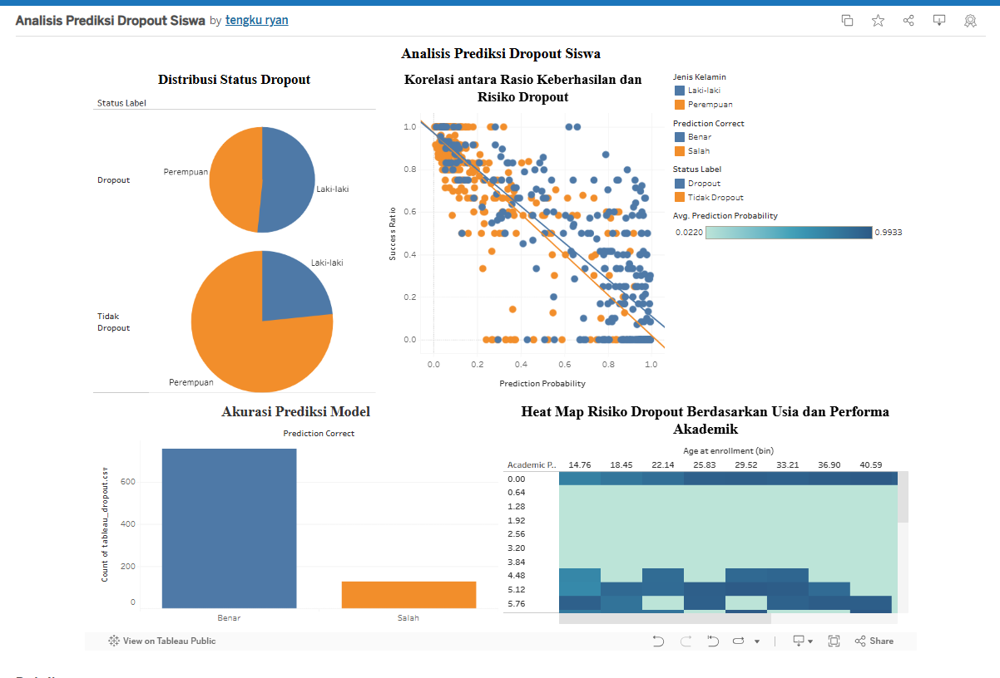

"# penerapan_data_sains_2" 
# Proyek Akhir: Menyelesaikan Permasalahan Perusahaan Edutech
## Business Understanding

Jaya Jaya Institut adalah institusi pendidikan tinggi yang telah berdiri sejak tahun 2000 dan memiliki reputasi yang baik dalam mencetak lulusan berkualitas. Namun, institusi ini menghadapi tantangan besar dengan tingginya angka siswa yang tidak menyelesaikan pendidikan mereka atau dropout.

Untuk mengatasi masalah ini, Jaya Jaya Institut berupaya mendeteksi siswa yang berpotensi dropout sejak dini agar dapat diberikan bimbingan khusus. Sebagai calon data scientist, Anda diminta untuk membantu institusi ini dalam menganalisis data dan memberikan solusi untuk mengurangi angka dropout tersebut.

### Permasalahan Bisnis

1. Tingginya angka siswa yang tidak menyelesaikan pendidikan atau dropout.
2. Kurangnya sistem deteksi dini untuk mengidentifikasi siswa yang berpotensi dropout.
3. Minimnya data analisis yang dapat digunakan untuk memberikan bimbingan khusus kepada siswa yang membutuhkan.
4. Dampak negatif terhadap reputasi institusi akibat tingginya angka dropout.
5. Kebutuhan untuk meningkatkan efisiensi dan efektivitas dalam memberikan solusi berbasis data untuk mengurangi angka dropout.

### Cakupan Proyek

Proyek ini akan mencakup langkah-langkah berikut:

1. **Eksplorasi Data**: Mengumpulkan dan menganalisis data siswa untuk memahami pola dan faktor-faktor yang berkontribusi terhadap dropout.
2. **Pra-pemrosesan Data**: Membersihkan dan mempersiapkan data agar siap digunakan untuk analisis lebih lanjut.
3. **Pengembangan Model Machine Learning**: Membuat model prediktif untuk mendeteksi siswa yang berpotensi dropout berdasarkan data historis.
4. **Evaluasi Model**: Mengukur kinerja model menggunakan metrik evaluasi yang relevan untuk memastikan akurasi dan keandalannya.
5. **Pembuatan Dashboard**: Mengembangkan dashboard interaktif untuk memvisualisasikan hasil analisis dan memberikan wawasan kepada pemangku kepentingan.
6. **Rekomendasi Solusi**: Memberikan rekomendasi berbasis data untuk membantu institusi mengurangi angka dropout.
7. **Dokumentasi dan Presentasi**: Menyusun laporan akhir dan mempresentasikan hasil proyek.

### Persiapan

#### Sumber Data
Proyek ini menggunakan dataset yang tersedia di repositori berikut: [Dataset](https://github.com/dicodingacademy/dicoding_dataset/tree/main/students_performance). Dataset ini berisi informasi terkait performa siswa, termasuk data demografis, akademik, dan faktor-faktor lain yang relevan untuk analisis. Dataset ini mencakup kolom-kolom berikut:

- **Marital_status**: Status pernikahan siswa.
- **Application_mode**: Mode aplikasi yang digunakan saat mendaftar.
- **Application_order**: Urutan aplikasi yang diajukan.
- **Course**: Program studi yang diambil siswa.
- **Daytime_evening_attendance**: Kehadiran siswa (siang/malam).
- **Previous_qualification**: Kualifikasi pendidikan sebelumnya.
- **Previous_qualification_grade**: Nilai dari kualifikasi pendidikan sebelumnya.
- **Nacionality**: Kewarganegaraan siswa.
- **Mothers_qualification**: Kualifikasi pendidikan ibu.
- **Fathers_qualification**: Kualifikasi pendidikan ayah.
- **Mothers_occupation**: Pekerjaan ibu.
- **Fathers_occupation**: Pekerjaan ayah.
- **Admission_grade**: Nilai masuk siswa.
- **Displaced**: Status apakah siswa pindah tempat tinggal.
- **Educational_special_needs**: Kebutuhan pendidikan khusus.
- **Debtor**: Status apakah siswa memiliki utang.
- **Tuition_fees_up_to_date**: Status pembayaran biaya kuliah.
- **Gender**: Jenis kelamin siswa.
- **Scholarship_holder**: Status penerima beasiswa.
- **Age_at_enrollment**: Usia saat pendaftaran.
- **International**: Status siswa internasional.
- **Curricular_units_1st_sem_credited**: Jumlah mata kuliah semester pertama yang diakui.
- **Curricular_units_1st_sem_enrolled**: Jumlah mata kuliah semester pertama yang diambil.
- **Curricular_units_1st_sem_evaluations**: Jumlah evaluasi mata kuliah semester pertama.
- **Curricular_units_1st_sem_approved**: Jumlah mata kuliah semester pertama yang disetujui.
- **Curricular_units_1st_sem_grade**: Nilai rata-rata mata kuliah semester pertama.
- **Curricular_units_1st_sem_without_evaluations**: Jumlah mata kuliah semester pertama tanpa evaluasi.
- **Curricular_units_2nd_sem_credited**: Jumlah mata kuliah semester kedua yang diakui.
- **Curricular_units_2nd_sem_enrolled**: Jumlah mata kuliah semester kedua yang diambil.
- **Curricular_units_2nd_sem_evaluations**: Jumlah evaluasi mata kuliah semester kedua.
- **Curricular_units_2nd_sem_approved**: Jumlah mata kuliah semester kedua yang disetujui.
- **Curricular_units_2nd_sem_grade**: Nilai rata-rata mata kuliah semester kedua.
- **Curricular_units_2nd_sem_without_evaluations**: Jumlah mata kuliah semester kedua tanpa evaluasi.
- **Unemployment_rate**: Tingkat pengangguran.
- **Inflation_rate**: Tingkat inflasi.
- **GDP**: Produk Domestik Bruto.
- **Status**: Status akhir siswa (misalnya, lulus, dropout, dll.).

Kolom-kolom ini memberikan wawasan yang kaya untuk analisis dan pengembangan model prediktif.

#### Setup Environment


## 🌐 Opsi 1: Menggunakan Google Colab (Direkomendasikan)
```python
!pip install -r requirements.txt
```

## 💻 Opsi 2: Menjalankan Secara Lokal

### 1. Membuat Virtual Environment
```bash
python -m venv venv
```

### 2. Mengaktifkan Virtual Environment
- **Windows**:
  ```bash
  .\venv\Scripts\activate
  ```
- **macOS/Linux**:
  ```bash
  source venv/bin/activate
  ```

### 3. Instalasi Dependensi
```bash
pip install -r requirements.txt
```

## 📝 Catatan Penting
1. Untuk Google Colab, tambahkan library tambahan dengan:
   ```python
   !pip install nama_library
   ```

2. Selalu aktifkan virtual environment sebelum menginstal paket baru di lingkungan lokal.

## Business Dashboard

### Penjelasan Dashboard
Dashboard yang telah dibuat menggunakan Metabase bertujuan untuk memberikan wawasan interaktif kepada pemangku kepentingan terkait analisis data siswa. Dashboard ini mencakup visualisasi data seperti tingkat dropout, distribusi nilai, dan faktor-faktor yang memengaruhi performa siswa. Dengan menggunakan dashboard ini, pengguna dapat dengan mudah mengidentifikasi pola dan tren yang relevan untuk pengambilan keputusan.

### Cara Mengakses Dashboard
Dashboard dapat diakses melalui platform tableau dengan langkah-langkah berikut:

1. Buka browser Anda dan akses URL berikut: [Tableau](https://public.tableau.com/views/AnalisisPrediksiDropoutSiswa/Dashboard1?:language=en-US&publish=yes&:sid=&:redirect=auth&:display_count=n&:origin=viz_share_link)

### Contoh Tampilan Dashboard
Berikut adalah contoh tampilan dari dashboard yang telah dibuat:



Dashboard ini dirancang untuk mempermudah eksplorasi data dan memberikan wawasan yang dapat ditindaklanjuti untuk mengurangi angka dropout siswa.

## Menjalankan Sistem Machine Learning
Untuk menjalankan prototype sistem machine learning yang telah dibuat, ikuti langkah-langkah berikut:

1. **Pastikan semua dependensi telah diinstal**  
    Gunakan file `requirements.txt` untuk menginstal semua dependensi yang diperlukan:
    ```bash
    pip install -r requirements.txt
    ```

2. **Jalankan aplikasi Streamlit**  
    Prototype sistem machine learning ini menggunakan Streamlit sebagai antarmuka pengguna. Jalankan aplikasi dengan perintah berikut:
    ```bash
    streamlit run app.py
    ```

3. **Akses aplikasi melalui browser**  
    Setelah perintah di atas dijalankan, aplikasi akan berjalan di server lokal. Anda dapat mengaksesnya melalui browser di alamat berikut:  
    [http://localhost:8501](http://localhost:8501) atau bisa langsung buka link (https://imnayr.streamlit.app/)

4. **Gunakan antarmuka aplikasi**  
    - Isi formulir yang tersedia dengan data mahasiswa, seperti status pernikahan, program studi, nilai masuk, dan informasi lainnya.
    - Klik tombol **"Analisis dan Prediksi Sekarang** untuk mendapatkan hasil prediksi.

5. **Interpretasi hasil prediksi**  

- **`BERISIKO DROPOUT`**: Diberikan kepada mahasiswa yang profil dan pola datanya memiliki kemiripan tinggi dengan mahasiswa yang secara historis tidak menyelesaikan studi.
- **`TIDAK BERISIKO`**: Diberikan kepada mahasiswa yang menunjukkan indikator-indikator positif kuat yang berkorelasi dengan tingkat kelulusan yang tinggi.
- Jika hasilnya **`BERISIKO`**, skor akan ditampilkan sebagai **"Probabilitas Risiko"** (misal: 82.5%), yang menunjukkan besarnya peluang mahasiswa tersebut untuk *dropout*.
- Jika hasilnya **`TIDAK BERISIKO`**, skor akan ditampilkan sebagai **"Probabilitas Bertahan"** (misal: 91.3%), yang menunjukkan besarnya peluang mahasiswa tersebut untuk *lulus atau lanjut*.
- **Untuk mahasiswa berisiko**, sistem akan menampilkan **"Faktor Risiko Utama"**. Ini adalah "lampu merah" 

- **Untuk mahasiswa yang aman**, sistem akan menampilkan **"Faktor Pendukung Utama"**. Ini adalah "lampu hijau" 
---

## Conclusion

Tingkat putus kuliah yang signifikan di Institut Jaya Jaya berakar pada kombinasi masalah finansial dan akademik. Analisis data menunjukkan bahwa tunggakan biaya kuliah, minimnya dukungan beasiswa, dan prestasi rendah di awal masa studi merupakan penyebab utama. Program studi tertentu, seperti Teknik Informatika dan Teknologi Produksi Biofuel, menunjukkan tingkat kerawanan tertinggi. Selain itu, mahasiswa laki-laki, berusia muda, dan berstatus debitur teridentifikasi sebagai kelompok paling berisiko. Dengan menggunakan dasbor interaktif dan model prediktif, institusi dapat secara proaktif mengidentifikasi mahasiswa ini dan memberikan dukungan yang diperlukan, yang pada akhirnya bertujuan untuk menurunkan angka dropout dan meningkatkan citra institusi.

## Rekomendasi Action Items
Menyongsong tahun akademik mendatang dan sebagai respons terhadap tantangan retensi mahasiswa, berikut adalah proposal lima inisiatif strategis yang dirancang untuk diimplementasikan oleh **Institut Jaya Jaya**. Setiap inisiatif bertujuan untuk membangun ekosistem pendidikan yang proaktif, suportif, dan adaptif bagi seluruh mahasiswa.

- Menginisiasi sebuah platform yang ditenagai *machine learning* untuk memproyeksikan probabilitas *dropout* setiap mahasiswa secara *real-time*. Dengan mengintegrasikan data akademik, finansial, dan demografis, sistem ini akan menghasilkan "skor risiko" yang memungkinkan tim akademik untuk melakukan intervensi secara presisi dan proaktif.
- Melakukan reformulasi skema dukungan finansial agar lebih inklusif dan mudah diakses. Langkah ini mencakup diversifikasi jenis beasiswa (berbasis prestasi dan kebutuhan) serta pengenalan opsi pembayaran biaya kuliah yang dapat dipersonalisasi, sehingga meringankan beban mahasiswa yang menghadapi tantangan ekonomi.
- Mengembangkan sebuah ekosistem dukungan holistik, terutama bagi mahasiswa di tahun pertama. Program ini mencakup tiga pilar utama: (a) klinik belajar untuk mata kuliah dasar, (b) pendampingan intensif oleh tutor sebaya, dan (c) sesi bimbingan studi oleh dosen wali untuk membantu navigasi tantangan akademik awal.
- Melakukan kalibrasi ulang terhadap kurikulum dan metodologi pengajaran pada program studi dengan tingkat atrisi tertinggi. Proses ini melibatkan modernisasi materi ajar dan pengembangan jalur studi alternatif—seperti kelas hibrida atau program malam yang fleksibel—untuk memenuhi kebutuhan beragam mahasiswa.
- Mendirikan sebuah unit khusus yang tidak hanya menyediakan layanan konseling psikologis rahasia, tetapi juga aktif menyelenggarakan lokakarya untuk membangun ketahanan mental, manajemen stres, dan kecerdasan emosional. Unit ini bertujuan untuk membekali mahasiswa, khususnya yang berada di masa transisi, dengan kemampuan untuk menghadapi tekanan perkuliahan.

---
rekomendasikan untuk:

- **Membentuk Gugus Tugas (Task Force):** Membentuk tim lintas fungsional yang bertanggung jawab atas perencanaan detail dan implementasi setiap inisiatif.
- **Menetapkan Metrik Keberhasilan (KPIs):** Mengembangkan indikator kinerja utama yang terukur untuk mengevaluasi efektivitas setiap program.
- **Menyusun Peta Jalan (Roadmap):** Membuat linimasa dan alokasi sumber daya yang jelas untuk setiap fase implementasi.
